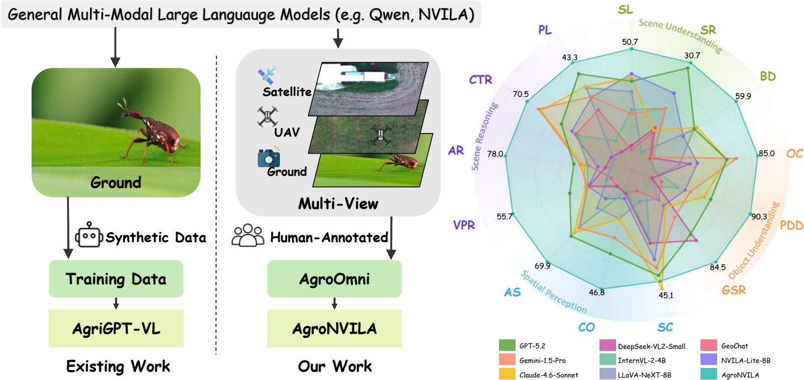

# AgroOmni



This repository contains the training code used in our paper **AgroOmni: A Large-Scale Multi-view Agricultural Dataset for Cross-Scale Multimodal Reasoning**.

Modern agricultural data spans multiple spatial scales, from ground-level close-up photography to UAV and satellite remote sensing, yet existing multimodal large language models (MLLMs) are trained almost entirely on ground-level imagery. This causes a severe **ground-level bias**: aerial farmland scenes get misread as walls or floors, a failure we term *scale confusion* and *semantic collapse*. To close this gap, we introduce **AgroOmni**, a large-scale multi-view agricultural instruction-tuning corpus with **288K** VQA pairs covering **56 task categories** across **14 task types**. Built on it, **AgroNVILA** achieves a new state of the art of **62.32%** on the **AgroMind** benchmark (**+15.03%** over GPT-5.2), and improves substantially on **AgMMU** after even minimal fine-tuning.

## Links

- **Paper**: <https://arxiv.org/html/2603.14342v2>
- **Code**: <https://github.com/Jrookie2005/AgroOmni>
- **Dataset**: <https://huggingface.co/datasets/AgroOmni/AgroOmni>

## Official NVILA Instructions

The original upstream NVILA documentation in this repo has been renamed to [README_NVILA.md](README_NVILA.md).

For environment setup, dependency installation, and the original NVILA training pipeline, follow [README_NVILA.md](README_NVILA.md) first. The rest of this document only covers the AgroOmni-specific additions.

Environment setup follows the upstream script and accepts any environment name:

```bash
bash environment_setup.sh <env_name>
```

> **Note on inherited upstream files.** The directories `data_prepare/`, `longvila/`, `vila_hd/`, `demo_trt_llm/` and `serving/`, together with `README_NVILA.md`, are inherited from the upstream NVILA / VILA codebase and are **not** required by the AgroOmni recipes. In particular, `data_prepare/` holds the upstream VILA pre-training and SFT data-preparation scripts (COYO, MMC4, Panda70M, ReCTS, ...), which are unrelated to AgroOmni: the AgroOmni training data is downloaded ready-to-use from Hugging Face (see below).

## AgroOmni SFT

The AgroOmni SFT entry script is:

```bash
bash scripts/NVILA-Lite/agroomni_sft.sh <stage_path> AgroOmni <output_dir>
```

Defaults in `scripts/NVILA-Lite/agroomni_sft.sh`:

Defaults in `scripts/NVILA-Lite/agroomni_sft.sh`:

- `stage_path`: `$HOME/model/NVILA-Lite-8B`
- `data_mixture`: `AgroOmni`
- `output_dir`: `runs/train/AgroNVILA_SFT`
- `CUDA_VISIBLE_DEVICES`: `0,1,2,3,4,5,6,7` (override the variable to use fewer GPUs)

### 1. Download AgroOmni from Hugging Face

Download the AgroOmni SFT data from Hugging Face (<https://huggingface.co/datasets/AgroOmni/AgroOmni>) and place it on local disk according to the official NVILA data format.

```bash
hf download AgroOmni/AgroOmni --repo-type dataset --local-dir /path/to/AgroOmni
```

The SFT loader in this codebase expects an NVILA/LLaVA-style supervised dataset, typically:

- one JSON file containing the conversations
- one image root directory referenced by that JSON

### 2. Register AgroOmni in `default.yaml`

Following the official NVILA dataset registration workflow, add an `AgroOmni` entry to [llava/data/registry/datasets/default.yaml](llava/data/registry/datasets/default.yaml).

Example:

```yaml
---
AgroOmni:
  _target_: llava.data.LazySupervisedDataset
  data_path: /path/to/agroomni_sft.json
  image_folder: /path/to/agroomni_images
```

Use your actual local paths for `data_path` and `image_folder`. The `AgroOmni` key should match the second argument of `agroomni_sft.sh`.

### 3. Launch SFT

```bash
bash scripts/NVILA-Lite/agroomni_sft.sh /path/to/base_or_pretrained_model AgroOmni runs/train/AgroNVILA_SFT
```

This script performs LoRA-based SFT with:

- frozen language model
- trainable `mm_projector`
- trainable LoRA adapters on the LLM
- `paligemma-siglip-so400m-patch14-448` as the vision tower

## RL Training

The RL recipes for AgroNVILA -- GRPO, PPO, and the domain-aware DRPO variant -- are **coming soon**.

## Notes

- SFT uses the NVILA data registry and `data_mixture=AgroOmni`.
- RL code is not included in this release yet; see the RL Training section above.
- If you need the original NVILA training stages such as alignment, stage-1.5, or pretraining, see [README_NVILA.md](README_NVILA.md) and [scripts/NVILA-Lite](scripts/NVILA-Lite).

## Related resources

- [AgroMind](https://github.com/rssysu/AgroMind): the agricultural VQA benchmark used for the evaluation reported in the paper.

## License

- **Code** in this repository is released under the [Apache License 2.0](LICENSE), inherited from the
  upstream [NVILA / VILA](https://github.com/NVlabs/VILA) codebase, with modifications for AgroOmni.
  See [LICENSE](LICENSE) and [README_NVILA.md](README_NVILA.md).
- **Our annotations** (the question–answer pairs and instruction templates contributed by this
  project): [CC BY-SA 4.0](https://creativecommons.org/licenses/by-sa/4.0/).
- **Images**: aggregated from publicly available agricultural datasets and a self-collected parcel
  dataset. Each source **keeps its own license**, and the copyright of the third-party imagery remains
  with its original owners. Portions taken from `EarthVQA` (CC BY-NC-SA 4.0) and `Pest`/IP102
  (academic use only) are **not for commercial use**. The full per-source license table is on the
  [dataset card](https://huggingface.co/datasets/AgroOmni/AgroOmni#license-and-attribution).
- Model weights derived from NVILA follow the upstream NVILA model license.

## Citation

If you find AgroOmni or AgroNVILA useful in your research, please cite:

```bibtex
@inproceedings{zhang2026agroomni,
  title     = {AgroOmni: A Large-Scale Multi-View Agricultural Dataset for Cross-Scale Multimodal Reasoning},
  author    = {Zhang, Jiarui and Hu, Junqi and Mai, Zurong and Liu, Yang and Chen, Yuhang and
               Lou, Shuohong and Huang, Henglian and Cheng, Hong and Zhao, Lingyuan and
               Huang, Jianxi and Lu, Yutong and Fu, Haohuan and Zheng, Juepeng},
  booktitle = {Advances in Neural Information Processing Systems (NeurIPS)},
  year      = {2026}
}
```
